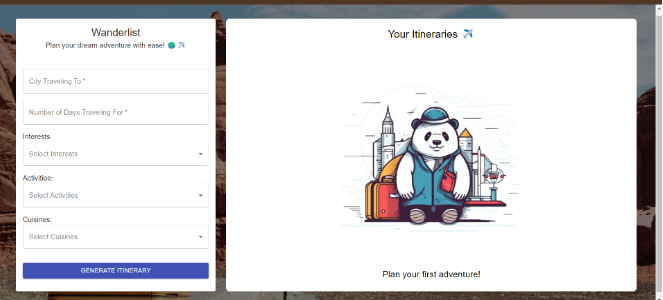
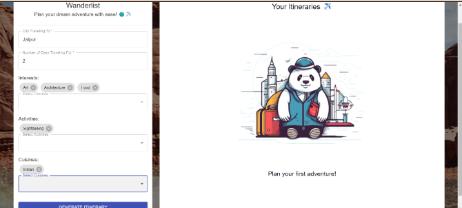
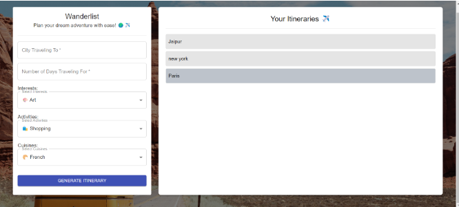
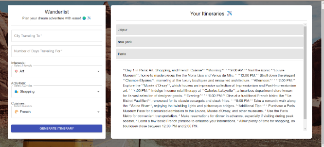

# WanderList

## Project Overview
WanderList is a web application designed to generate personalized travel itineraries based on user preferences such as budget, interests, and trip duration. Utilizing Google's Gemini 1.5 Flash model, WanderList offers a user-friendly interface that enhances the travel planning experience.

## Features
- **User-Friendly Interface:** Easy navigation for users to input their travel preferences.
- **Multiple Input Options:** Capture essential details including:
  - City Name
  - Number of Days
  - Interests (up to three)
  - Activity Types (up to three)
  - Cuisine Types (up to two)
- **Dynamic Itinerary Generation:** Integration with the Gemini 1.5 Flash model for AI-generated itineraries.
- **Dual-Card Layout:** Two cards displaying input options and generated itineraries.
- **Local Storage:** Save and access multiple itineraries easily.

## How It Works
1. **Input Preferences:** Users fill out the form with their travel details.
2. **Generate Itinerary:** After submission, the data is sent to the Gemini 1.5 Flash model via API.
3. **Display Itineraries:** Generated itineraries appear as tiles, which can be clicked for more information.
4. **Storage:** All itineraries are stored in local storage for easy retrieval.

## User Personalization
WanderList emphasizes user personalization by allowing selections for interests, activities, and cuisine preferences, ensuring tailored itineraries. Fun elements, like emojis, enhance user engagement.

## Future Improvements
Potential improvements include better formatting of Gemini API responses and additional input options for enhanced itinerary generation.

## Screenshots
This is a deployed version of my project on Netlify.  
Check it out here: [Live Demo](https://your-netlify-app-link.netlify.app)

## Conclusion
WanderList successfully addresses the need for personalized travel itineraries by leveraging generative AI to provide tailored experiences based on user preferences. This project demonstrates the potential of combining user-friendly design with advanced technology to enhance travel planning. While the current prototype offers essential features, future improvements could include refining the API response formatting and expanding input options to further enrich itinerary generation. Overall, WanderList serves as a promising foundation for creating customized travel experiences that cater to individual needs.

